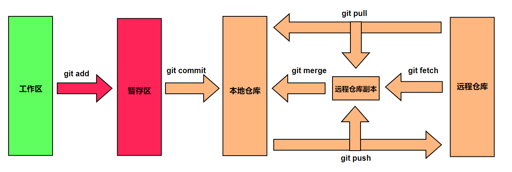
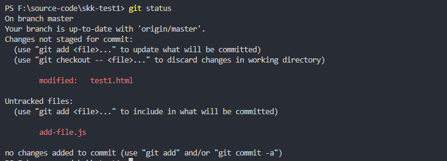
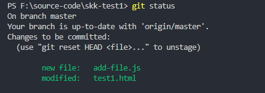
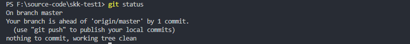

### git中的工作区、暂存区、本地仓库以及远程仓库
平常我们编辑完代码后，需要先后经常git add, git commit, git pull, git push这几个步骤后，
我们才能将本地代码传到github的远程仓库上面。那么在这个过程中，修改的代码是怎么一步步的传递
到远程仓库里面去的呢，本地代码又是怎么同步远程仓库的代码的呢，git pull和git fetch又有什么关系呢，
git fetch下来的代码又被放在哪里去了？这些正是本篇文章需要搞清楚的问题。

#### 1.工作区、暂存区、本地仓库以及远程仓库
首先看下面这张图

__工作区__ 简单来说就是你的工作目录，也就是你平时改代码的地方，在工作区修改的代码需要通过git add，将代码提交到暂存区
运行git status可以查看当前仓库的状态，修改和新增的文件都会用红色文字标出，并且新增的文件是Untracked状态，如下图  

__暂存区__ 在git里面暂存区是一个重要的概念，它相当于上传代码的一个过度区域，所有在本地修改的代码，都需要先提交到暂存区，然后才能提交到仓库里面去。在项目的根目录有一个.git文件夹，里面的index文件存放的就是暂存区的数据，所以在git的帮助文档里面也将暂存区称为 __索引区index__。通过git add .命令，可以将所有修改的代码添加到暂存区，此时在运行git status命令，发现所有改动的文件都显示绿色了，如下图  

__本地仓库__ 我们将修改代码提交到暂存区后，就可以通过命令git commit将暂存区的内容提交到本地仓库，执行git commit后，会生成一条commit提交记录。此时再运行git status会告诉你，工作区已经清空了，没有东西可以提交了。如下图  

__远程仓库__ 远程仓库和本地仓库是一样的概念，本地仓库可以通过git push将本地修改过后的代码提交到远程仓库，也可以通过git pull将远程仓库最新的代码拉到本地，然后再合并到本地的仓库中

__远程仓库副本__ 在我们通过git push将本地代码提交到远程仓库之前，通常需要git fetch将远程仓库最新的代码拉到本地来，此时拉下来的代码并没有合并到本地仓库中，而是被放在了所谓的 __远程仓库副本__ 中，然后再通过git merge将拉下来的代码合并到本地仓库中。通常我们用的是git pull，而不是git fetch。其实git pull = git fetch + git merge 

#### 2.git pull 和 git fetch
在前面稍微提了一嘴，git pull = git fetch + git merge
其中git fetch的完全命令形式是 __git fetch &nbsp;&nbsp;<远程仓库名> &nbsp;&nbsp;<远程分支名>__
如果省略后面两个参数，直接使用 __git fetch__ 或者 __git fetch origin__ 表示将远程仓库所有分支代码取回，放在本地的 __远程仓库副本__ 中，
如果使用 __git fetch origin master__ 表示只将远程仓库的master分支的内容取回，放在本地的 __远程仓库副本__ 中，
其中的 __origin__ 表示远程仓库的名字，在git clone克隆项目到本地的时候，它会自动给远程仓库取名叫 __origin__ 。
可以通过 __git clone -o \<name\>__ 给远程仓库重新命名，或者通过 __git remote rename \<old\> \<new\>__ 也可以修改远程仓库的名字。  

__git merge__ 的常见用法 __git merge <需要合并的分支>__ 
比如，你现在的本地当前分支是 __dev__ 那么 __git merge fix__ 表示将 __远程仓库副本__ 中的 __fix__ 分支内容合并到当前分支 __dev__ 中
git merge更加详细的用法这里就不赘述了，想了解更多的请 [点击这里](https://git-scm.com/docs/git-merge)  

__git pull__ 最长见的用法 __git pull <远程仓库名> <远程分支名>__
比如，__git pull origin dev__ 表示将远程的 __dev__ 分支拉到本地，然后和当前分支合并
如果你本地的当前分支是dev，就是和dev分支合并，如果当前分支是fix分支，就是和fix分支合并
还有另一种用法 __git pull <远程仓库名> <远程分支名>:<本地分支名>__
比如，__git pull origin fix:dev__ 表示将远程的 __fix__ 分支拉到本地，然后和本地的 __dev__ 分支合并

#### 3.git push
__git push__ 最长见的用法 __git push <远程仓库名> <远程分支名>__
比如，__git push origin dev__ 表示将当前分支推送到远程的 __dev__ 分支上
还有另一种用法 __git push <远程仓库名> <本地分支名>:<远程分支名>__
比如，__git push origin dev:fix__ 表示将本地的 __dev__ 分支推送到远程的 __fix__ 分支上